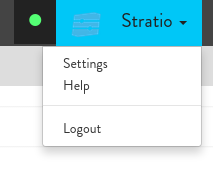

=============
Configuration
=============

In Stratio Explorer some  interpreters end point may be 
configure by user using the same web client.

Following interpreters end point can be configure by user.

- Crossdata
- Ingestion
- Cassandra

To configure any interpreter please follow this steps:

1.-Click in Stratio button 
~~~~~~~~~~~~~~~~~~~~~~~~

2.-Click in Settings option
~~~~~~~~~~~~~~~~~~~~~~~~

3.-Select interpreter to configure
~~~~~~~~~~~~~~~~~~~~~~~~~~~~~~~~

To configure any interpreter button "+" should be clicked
