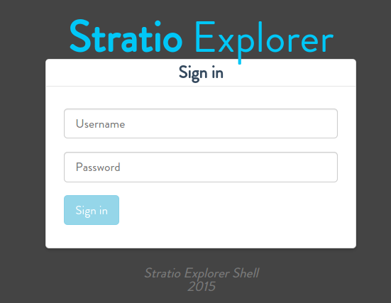
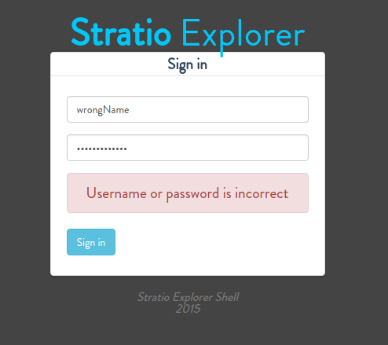
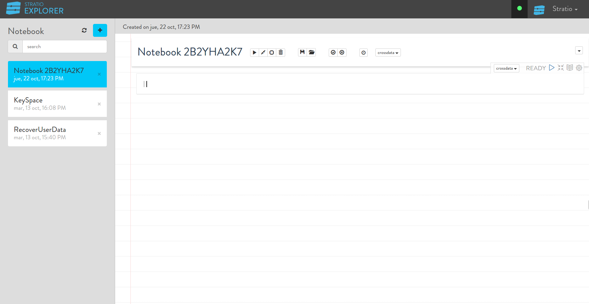
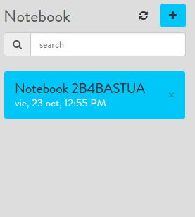
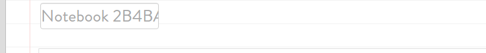
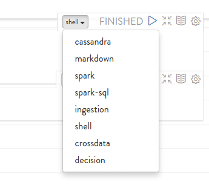
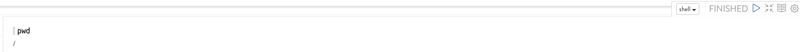
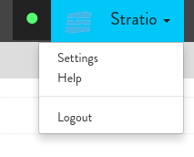
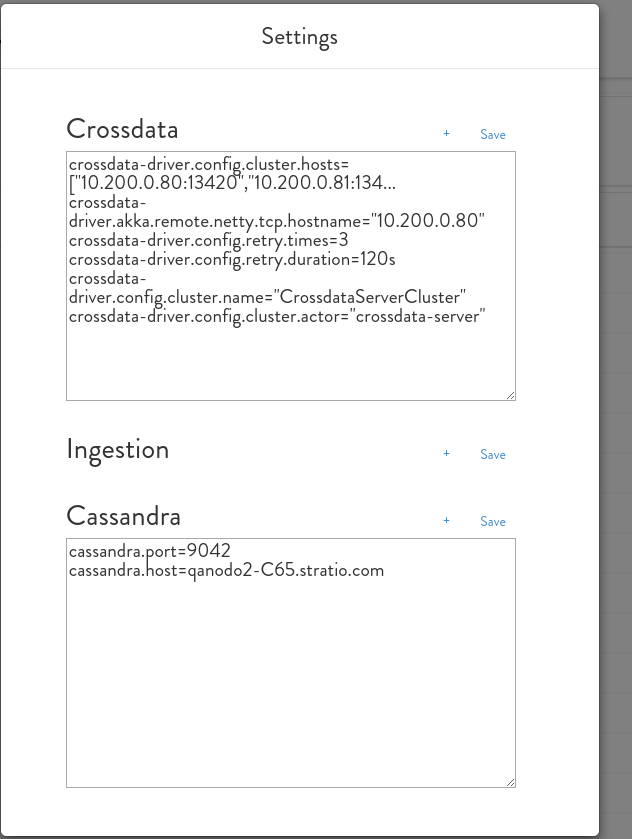

=================
Reference Guide
=================

Table of contents
*****************

-  `1) LOGIN EXPLORER <#login-explorer>`__

-  `2) NOTEBOOKS <#notebooks>`__
    -  `2.1) CREATE <#create>`__
    -  `2.2) CHANGE NAME <#change-name>`__
    -  `2.3) REMOVE <#remove>`__

-  `3) PARAGRAPHS <#paragraphs>`__
    -  `3.1) EXECUTE <#execute>`__
    -  `2.2) CHANGE NAME <#change-name>
    -  `2.3) REMOVE <#remove>`__

-  `4) SETINGS <#settings>`__
    - `4.1) INTERPRETERS <#interpreters>`__
    

1.- Login Explorer
==================

To use explorer first you need authenticate in Stratio Explorer aplication with login and password.

When Username and Password it's filled then click sign-in button. If UserName and password is correct
then you enter in Stratio Explorer . If Username or Password is wrong then you will see an error message.

2.- Notebooks
==============

<<<<<<< HEAD
The main element of Stratio explorer are notebooks .
=======
The main element of Stratio explorer is a notebooks .
>>>>>>> docu Notebooks

2.1.- Create 
------------

To create new notebook you must click in "+" button in this panel.

And application create new Notebook automatically.

2.2.- Change name
-----------------

User can change name of notebook in this input type

2.3.- Remove
------------

To remove notebook click "x" button 

3.- Paragraphs
==============

Notebooks are composed by paragraphs. User can execute interpreters in paragraphs. The first paragraph 
is created automatically with the Notebook. Next paragraphs will be created when execute actual paragraph first time.

3.1.- Execute 
-------------

To execute a paragraph user must select a interpreter in paragraph.

Before interpreter have been selected the user must to write an instruction of interpreter. Result show under the command .

If you want stop the execution then click stop button this button show when click in play button.

4.- settings
==============

User can modify setting if button settings is clicked.

4.1.- Interpreters 
------------------

You can change configuration of Stratio Ingestion , Stratio Crossdata and Cassandra interpreter.

Values must be configure same parameters that explained `in configuration  <03_configuration.rst>`__

to save new settings user must click "save" button
