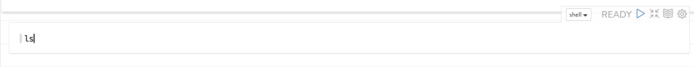

=====================
Quick Reference
=====================

Quick Explorer reference. More details can be found at `reference guide. <06_reference_guide.rst>`__

Login
------

You must open the URL (http://<host>:8084), write the user and password and finally click in "Sign in" Button in order to access Stratio Explorer.

 The default user is:
 User: Stratio
 Password: Stratio

.. image:: images/login.png

Logout
------

You must click Logout option in order to Stratio Explorer log out.

.. image:: images/settings_option.png
   :height: 172px
   :width: 213px
   :align: center

Create new note
---------------

You must click over plus symbol in order to create a new note.

.. image:: images/new_note.png

Execute paragraph
---------------
You must click over play symbol in order to execute a paragraph.

